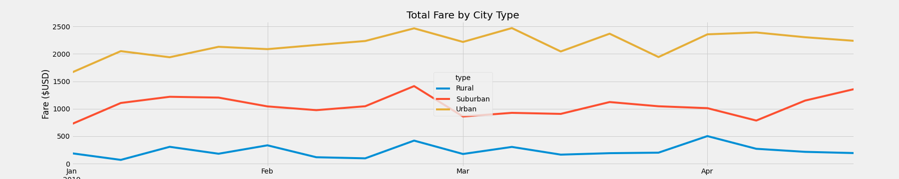

# PyBer_Analysis

## Overview of Analysis
During this Pyber analysis we evaulated the possible differences in fares, rides, and drivers across different types of regions (Urban, Suburban, Rural). We examined the pyber data to identify any trends and factors that may explain said trends. We will also take into account different dates to allow use to evaluate data over time.

## Results
While exaimining the Pyber data we sepereate the data based on the three types of region presented, Urban, Suburban, and Rural. This will allow us to compare the different areas and see if there are any significant differences in the regions. As we look at the data we can see that 'Average Fare per Rider' and ' Average Fare per Driver' are actually lowest in Urban areas. With a general understanding of Urban, Suburban and Rural areas we can speculate that the fare decreases the more densly populated an area is. This is not to negate the fact that a rural rider might need to travel farther to reach a destination and we must take this information into account as well. To better evaluate these two theory we would need to examine time or distance traveled by the rider.  

As we examine further we can simplify the data using a line graph to better represent the changes overtime. As seen in the graph below we have taken the total fares for each regional type and compared them side by side. We can see one spike across all three region, sometime around late Feburary. We can speculate that this is due to Washingtons Birthday, inwhich many people will take rides to prevent DUI's.

## Summary
As we complete out evaluate of the data we can see that Urban areas have the most fares due to population density. While Rural areas have the least amount of rides at the highest fares. We would need to further evaluate this data to determine the cause of this high fare. We can speculate the rides cost most either due to the distance and time it takes to travel to and from the rural areas or because of the lack of drivers. 
